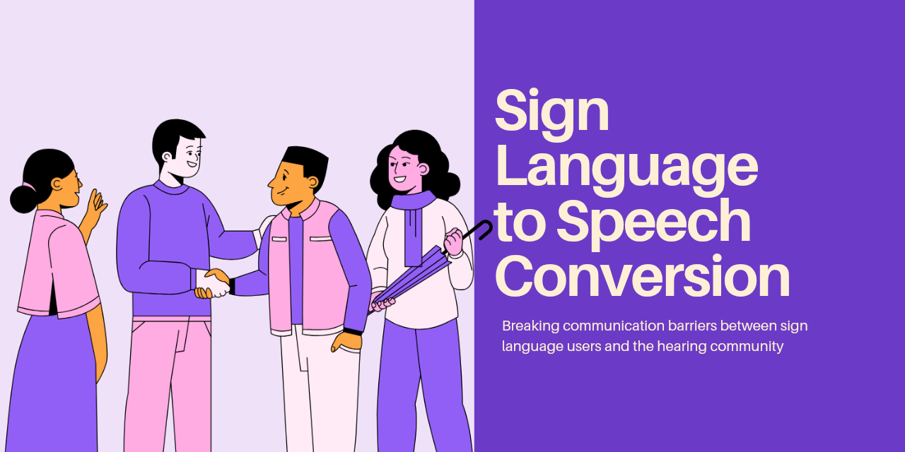
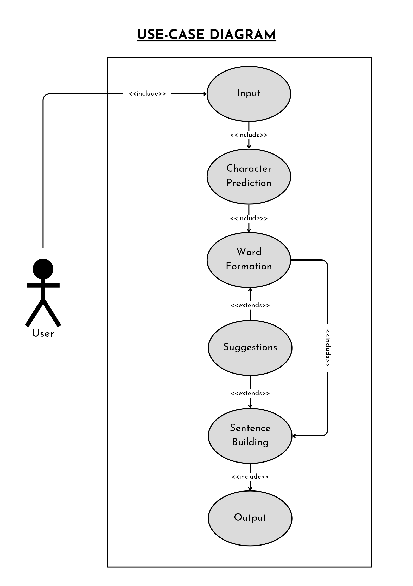
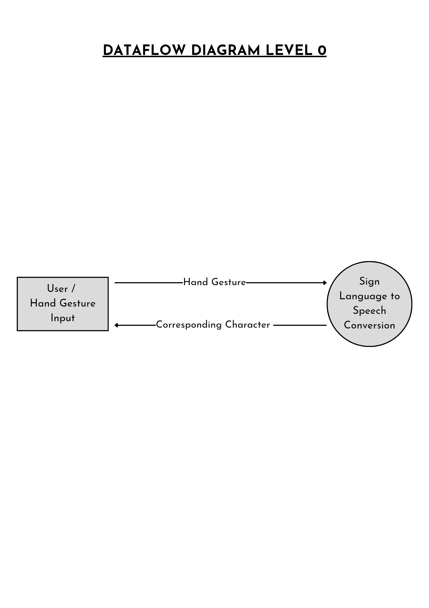
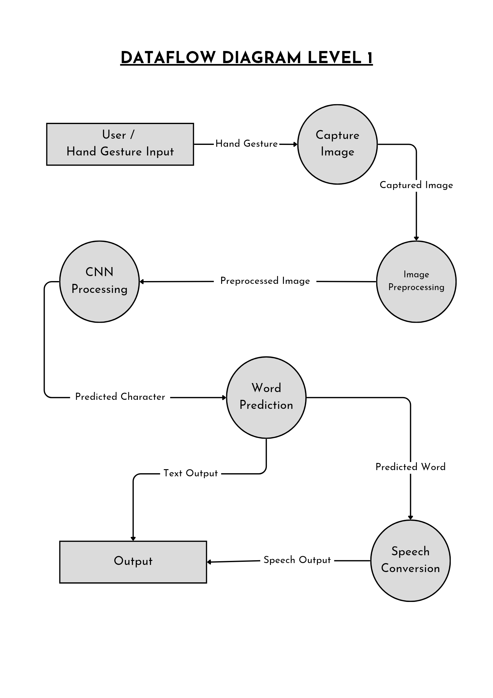
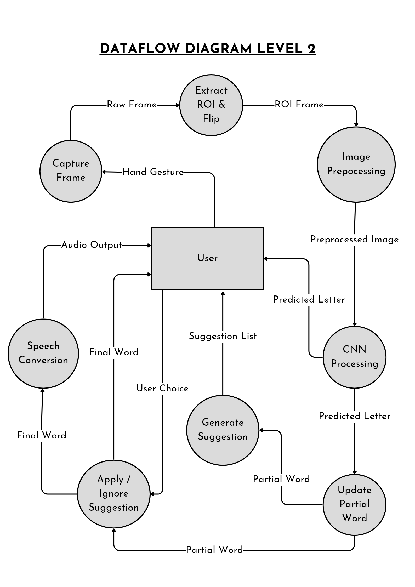

<div align="center">

[](https://github.com/RhythmusByte/Sign-Language-to-Speech)



[](https://opensource.org/licenses/BSD-3-Clause)


</div>

---

## 🎯 Project Overview
Real-time American Sign Language (ASL) translation system using computer vision and deep learning. Combines custom hand tracking with gesture classification to create accessible communication solutions.

> 🔮 **Development Update:** Core functionality implemented - refining accuracy and expanding gesture library

---

## ✨ Key Features
- 🔮 Real-time hand detection & gesture tracking
- 🧠 CNN-based classification using TensorFlow/Keras
- 🔊 Simultaneous text & speech output

---

## 📊 Project Documentation

### Use Case Diagram


### Data Flow Diagrams
| Level 0 | Level 1 | Level 2 |
|---------|---------|---------|
|  |  |  |

---

## 🛠 Tech Stack
### **Core Technologies**


### **Supporting Libraries**


---

## 📂 Repository Structure
```text
Sign-Language-to-Speech/
├── data/                  # Training datasets and gesture samples
├── Application.py        # Main application logic
├── trainedModel.h5       # Pretrained CNN model
├── requirements.txt      # Dependency specifications
└── white.jpg             # Background reference image
```

---

## 🚀 Installation Guide

### **Prerequisites**
- Python 3.9+ (Recommended)
- Webcam-enabled device
- 4GB+ RAM recommended

### **Setup Instructions**
1. Clone repository:
   ```bash
   git clone https://github.com/RhythmusByte/Sign-Language-to-Speech.git
   cd Sign-Language-to-Speech
   ```

2. Create virtual environment:
   ```bash
   python -m venv .venv
   ```

3. Activate environment:
   - Windows: `.venv\Scripts\activate`
   - Linux/MacOS: `source .venv/bin/activate`

4. Install dependencies:
   ```bash
   pip install -r requirements.txt
   ```

---

## 🖥 Usage
Launch the recognition system:
```bash
python Application.py
```

**System Flow:**
1. Webcam initialization
2. Hand detection & ROI extraction
3. Gesture preprocessing & normalization
4. CNN-based classification
5. Real-time text & speech output

---

## 📜 License
Distributed under BSD 3-Clause License. See [LICENSE](LICENSE).
